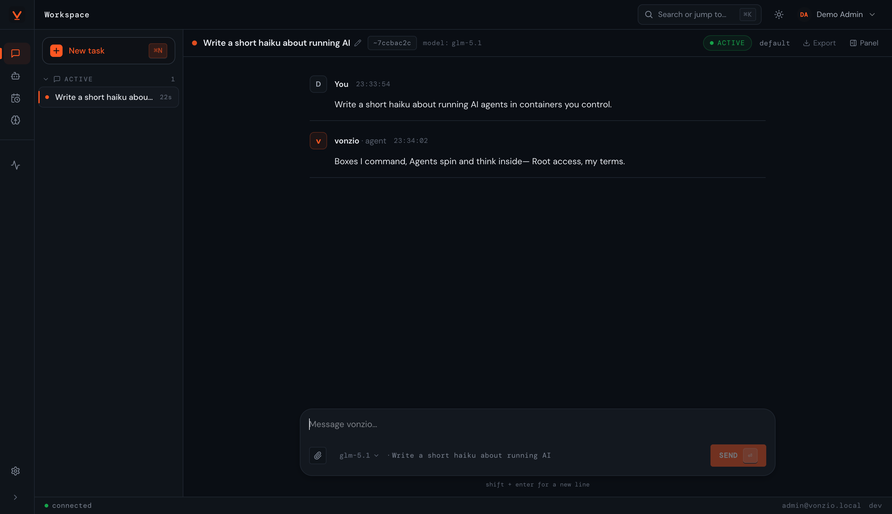
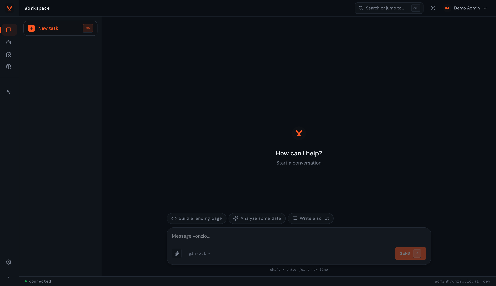
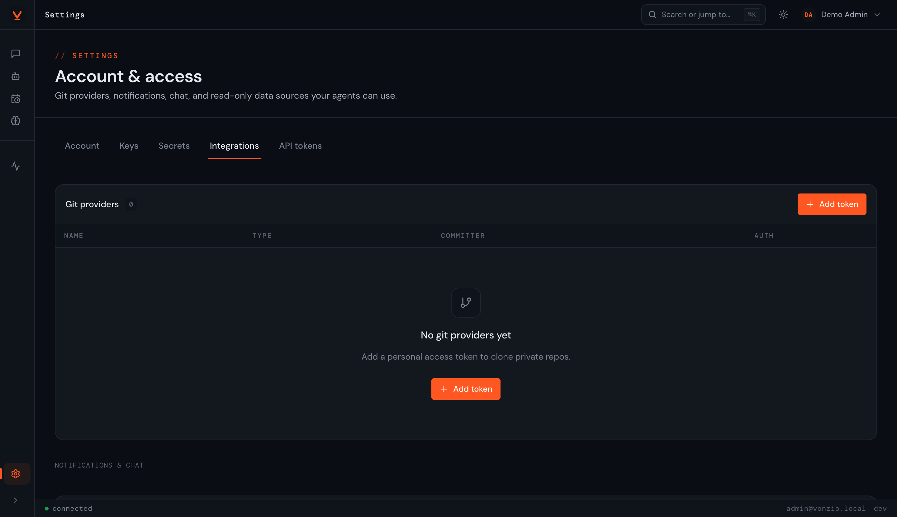
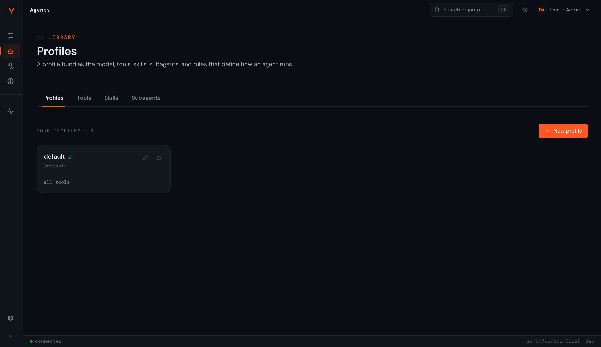
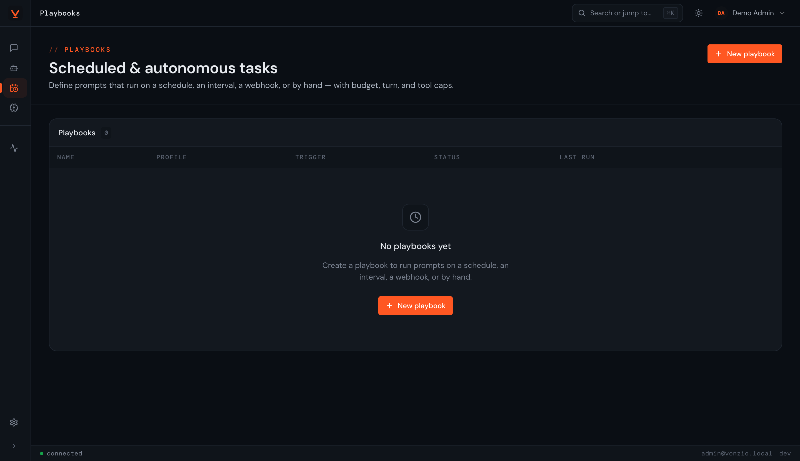

<p align="center">
  
</p>

<h1 align="center">vonzio</h1>

<p align="center">
  Run your agents in containers you control.<br>
  Open-source, self-hostable, single-tenant, bring your own model.
</p>

<p align="center">
  <a href="https://github.com/vonzio/vonzio/actions/workflows/ci.yml"></a>
  <a href="https://github.com/vonzio/vonzio/releases"></a>
  <a href="LICENSE"></a>
  
  
  <a href="https://vonzio.com">vonzio.com</a>
</p>

<p align="center"><sub>Pre-1.0 and actively developed — APIs may shift between minor versions.</sub></p>

<p align="center">
  
</p>

---

## What it does

vonzio runs agents in fresh Docker containers — one per conversation. You bring a credential for any supported model provider; vonzio brings the orchestration: a chat UI, a workspace for files, a session that remembers, MCP tools, and integrations.

- **Provider-agnostic** — Anthropic (Claude Sonnet/Opus/Haiku), Ollama Cloud (or any Anthropic-compatible gateway), and OpenAI / any OpenAI-compatible endpoint (translated in-container by a built-in gateway). Pick per profile or per workspace.
- **Containerized sessions** — each conversation runs in its own Docker container with a bind-mounted workspace
- **Chat surface** — full dashboard for direct use
- **Integrations** — GitHub, GitLab, Bitbucket, Slack, Telegram, Gmail; bank data (Teller) and more via external plugins
- **Playbooks** — scheduled or webhook-triggered agent chains with budget caps and success criteria
- **Memory and skills** — persistent agent memories, reusable skill snippets, custom subagents
- **MCP runtime** — bring your own MCP servers, or use the built-ins (memory, notify, gmail, platform)

## Who this is for

vonzio targets **single-tenant and trusted-team deployments**: you run
it on infrastructure you own, with prompts and tools you control.

**Use it for**

- Personal coding agents on your laptop or a private box
- A trusted team running shared agents against your own data
- Self-hosting an agent runtime that other people on your team can use

**Do not use it (without further hardening) for**

- Hosting arbitrary user-submitted code or prompts from the public internet
- Hostile multi-tenant scenarios — agent containers share the host kernel
- Regulated workloads that require hardware-level isolation

vonzio runs agents in Docker containers, not microVMs. Read
[docs/SECURITY_MODEL.md](docs/SECURITY_MODEL.md) for the full threat
model and [docs/HARDENING.md](docs/HARDENING.md) for opt-in steps
(gVisor, restricted Docker socket, network policies) that close the
gap for higher-trust deployments.

## Quickstart

One-line install on macOS or Linux (it asks before installing any missing dep):

```bash
curl -fsSL https://raw.githubusercontent.com/vonzio/vonzio/main/install.sh | bash
```

The installer checks for Docker, Compose v2, make, and openssl (git + Node are optional — only the `--build` / contributor path needs git). It generates a fresh `.env` with secure random secrets, **fetches just the compose files** (no `git clone`, no source tree), **pulls vonzio's prebuilt multi-arch images** (no compiling on your machine), brings up postgres, runs the one-time Better Auth schema migration, and starts the stack — usually about a minute on a warm machine. Add `--build` to clone the source and build the images instead.

By default it installs the **latest tagged release**. Pin to a specific version with `VONZIO_VERSION=v0.1.3` (or pass `--tag v0.1.3` after the `bash`) — useful for reproducible installs, security advisories, or staying off in-flight `main`:

```bash
VONZIO_VERSION=v0.1.3 curl -fsSL https://raw.githubusercontent.com/vonzio/vonzio/main/install.sh | bash
```

If you'd rather read the script first, the clone-then-run path uses the same code:

```bash
git clone https://github.com/vonzio/vonzio.git
cd vonzio
./install.sh
```

Then open the address the installer prints when it finishes — `http://localhost:3000` for the default pull-based install (or `:5173` if you used `--build`). First visit lands on `/setup` to create your admin account, then `/onboarding` to add a credential and pick a default model. After that you're in.

Full self-host guide with env reference, upgrade path, and troubleshooting: [docs/SELF_HOST.md](docs/SELF_HOST.md).

## How it works

Three processes on your host, one fresh Docker container per conversation.

```
        ┌──────────────────────────────────────────────────────────────────┐
        │                          Your machine                            │
        │                                                                  │
        │   ┌───────────────┐   HTTP / WS    ┌────────────────────────┐    │
        │   │   Dashboard    │ ─────────────▶│      core-server       │    │
        │   │  (React SPA)   │◀──── stream ──│       (Fastify)        │    │
        │   └───────────────┘                │                        │    │
        │                                    │  • Better Auth         │    │
        │                                    │  • Drizzle / Postgres  │    │
        │                                    │  • Orchestrator        │    │
        │                                    │  • Container pool      │    │
        │                                    │  • MCP runtime         │    │
        │                                    └──────────┬─────────────┘    │
        │                                               │ docker exec       │
        │                                               ▼                   │
        │                              ┌────────────────────────────────┐  │
        │                              │       Agent container          │  │
        │                              │  (one per conversation)        │  │
        │                              │                                │  │
        │                              │  agent-runner ─▶ LLM provider │  │
        │                              │  workspace/ (bind-mounted)     │  │
        │                              │  MCP servers (stdio / http)    │  │
        │                              └────────────────────────────────┘  │
        └──────────────────────────────────────────────────────────────────┘
```

**The path of a message.**

1. The dashboard opens a WebSocket to `core-server` and posts a message.
2. The orchestrator resolves the user's **profile** — model, system prompt, tools, MCP servers, container image — then asks the pool for a container. The pool either hands one back warm or provisions a fresh one with the profile's image and a bind-mounted `workspace/` directory.
3. Inside the container, `agent-runner` calls the configured **LLM provider** (Anthropic API key, Anthropic subscription token, Ollama Cloud, or any OpenAI-compatible endpoint), streams tokens back over the WebSocket, and runs tools / MCP calls in-process.
4. core-server logs every event (token, tool call, file write) and persists the session so the next message resumes in the same container with the same memory.

**Core concepts.**

- **Profile** — the agent recipe: model + system prompt + tool allowlist + MCP servers + container image + budget caps. Members can have many; admins can mark some as shared.
- **Models / providers** — pick per profile or per workspace: Anthropic (Claude Sonnet/Opus/Haiku), Anthropic subscription tokens, Ollama Cloud, or any OpenAI-compatible endpoint. Credentials are yours and stay encrypted at rest.
- **Workspace** — the per-conversation directory the agent reads and writes. Survives across messages; lives at `data/workspaces/<session_id>/` on the host.
- **Memory** — persistent, searchable agent memories scoped per user/profile, so a session recalls what mattered across conversations (backed by the `memory` MCP server).
- **Skills & subagents** — reusable prompt/skill snippets and custom subagents you define once and attach to profiles, instead of re-explaining the same context every time.
- **MCP runtime** — first-class support for stdio + HTTP MCP servers, scoped per profile. Bring your own, or use the built-ins: `memory`, `notify`, `gmail`, `platform`.
- **Integrations & plugins** — **built-in** integrations (GitHub / GitLab / Bitbucket / Slack / Telegram / Gmail) connect via OAuth on the dashboard and flow credentials into the container at launch. **Extensions** ship as external plugins loaded through a capability-gated, operator-approved loader (e.g. Teller bank data) — write your own with the [plugin guide](docs/PLUGINS.md).
- **Playbooks** — scheduled or webhook-triggered agent chains with budget caps and success criteria; runs are first-class observable workspaces.
- **Container pool** — warm containers are reused across conversations of the same profile; cold ones are torn down after a configurable idle window.

**Packages**, all AGPL-3.0-or-later:

- `@vonzio/shared` — types + cross-package interfaces (`ContainerManager`, `CoreDeps`, `Profile`, …)
- `@vonzio/core-server` — Fastify API, orchestrator, container lifecycle, MCP runtime, integrations
- `@vonzio/dashboard` — customer SPA (React + Vite)
- `agent-runner/` — the in-container process that drives the LLM and exposes the tool / MCP surface

## Screenshots

| Workspace — chat, one container per session | Integrations — built-in OAuth + plugin extensions |
|---|---|
|  |  |
| **Agents — profiles (model, prompt, tools, budget)** | **Playbooks — scheduled / webhook-triggered chains** |
|  |  |

## Documentation

- **[Self-hosting guide](docs/SELF_HOST.md)** — install, env reference, upgrade path, troubleshooting, local webhook testing
- **[Security model](docs/SECURITY_MODEL.md)** — threat model, trust boundaries, what's in and out of scope
- **[Hardening guide](docs/HARDENING.md)** — opt-in production hardening (gVisor, restricted Docker socket, egress policies, secret rotation)
- **[Plugin guide](docs/PLUGINS.md)** — write and publish external plugins: capabilities, manifest, the operator approval flow

## Hosted option

If you'd rather skip running your own postgres and Docker, [vonzio.com](https://vonzio.com) offers the same agent runtime as a managed multi-tenant service. The SaaS adds teams, invites, billing, and an admin panel that aren't part of the OSS package, built as a proprietary control plane that mounts onto the same data plane shipped here.

## Develop

```bash
# Full Docker stack, built from source with hot reload — recommended for dev
make docker-dev-oss

# Or run the prebuilt images without building (what the installer does by default)
make docker-pull-oss

# Host-mode — faster iteration on dashboard code; you supply postgres
make dev-oss

make urls          # print the dashboard / API / webhook addresses any time
make dev-tunnel    # DEV-ONLY: expose the stack so Slack/Telegram webhooks reach it
make test          # full test suite
make typecheck     # typecheck across packages
```

Both dev paths print a startup summary of where everything is. To test
webhook-based plugins (Slack, Telegram) against a local stack, `make dev-tunnel`
opens a public tunnel (cloudflared by default, no account) — see
[SELF_HOST.md](docs/SELF_HOST.md#local-webhook-testing-slack--telegram).

Project layout:

```
packages/
├── shared/          types and seam interfaces
├── core-server/     Fastify API + agent runtime + DB
├── dashboard/       customer React SPA
```

See [CONTRIBUTING.md](CONTRIBUTING.md) for the contribution flow.

## License

vonzio is licensed under GNU AGPL-3.0-or-later. See [LICENSE](LICENSE).

Practical translation:

- Run vonzio on your own infrastructure for personal or commercial use, free of charge.
- Fork it, modify it, integrate it into your own product.
- If you operate a modified vonzio as a network service for third parties, you must publish your modifications under AGPL too (this is the AGPL's defining clause — see §13).
- "vonzio" and the vonzio logo are trademarks; the AGPL doesn't grant trademark rights. Rebrand if you operate a fork as a service.

See [NOTICE](NOTICE) for the full open-core architecture explanation and third-party license summary.

---

<p align="center">
  <sub>Built by <a href="https://github.com/amenophis1er">Amen Amouzou</a>. Issues and PRs welcome.</sub>
</p>
