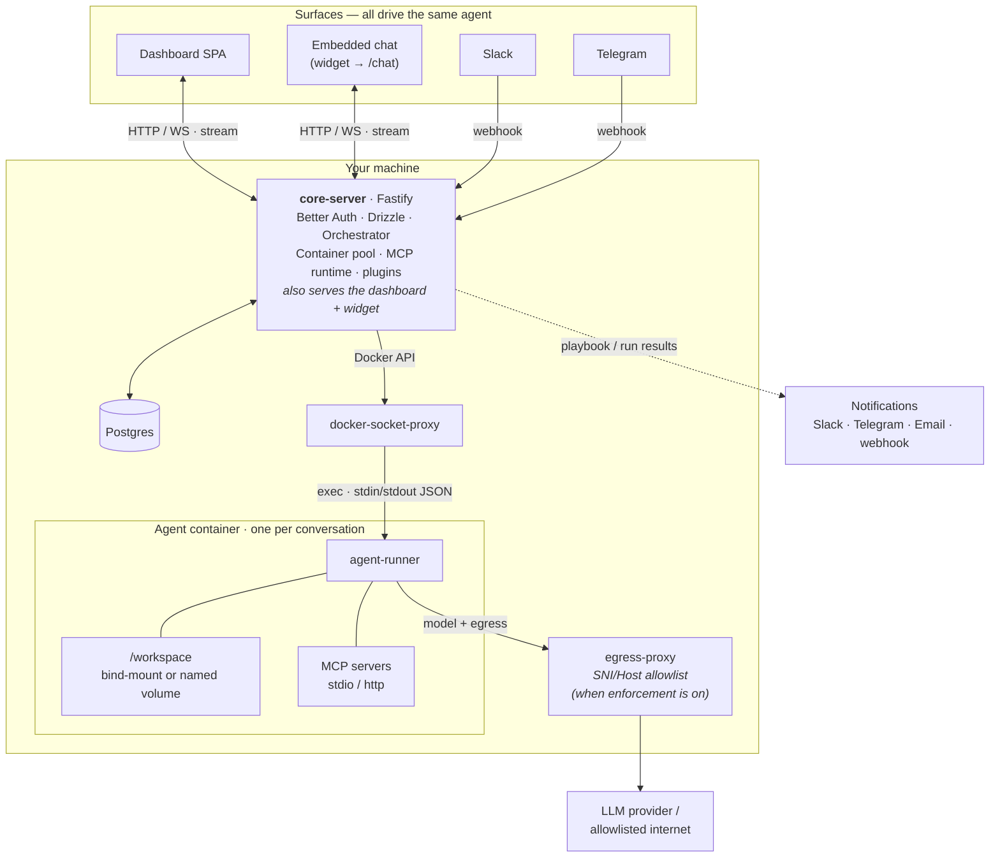

<p align="center">
  
</p>

<h1 align="center">vonzio</h1>

<p align="center">
  <b>Self-hosted AI agents. Bring your own model. Embed them anywhere.</b><br/>
  One isolated container per conversation — chat UI, a real file workspace, MCP tools,
  and a drop-in chat widget you can ship inside your own product.
</p>

<p align="center">
  <a href="LICENSE"></a>
  
  
</p>

---

## Run an agent in 5 minutes — and drop it into any page

vonzio gives you a real, tool-using AI agent that runs **on your own machine**, talks to
**any model you bring**, and can be embedded into your app, your docs, or your customer
support flow with a single `<script>` tag. Your keys and your data never leave your box.

```bash
curl -fsSL https://raw.githubusercontent.com/vonzio/vonzio/main/install.sh | bash
```

Then create a scoped API token (Settings → API tokens), pick the agent profile to expose,
and drop it into any page — Settings → **Embed** generates the exact snippet:

```html
<script
  src="https://YOUR_VONZIO_HOST/widget/vonzio.js"
  data-key="rc_YOUR_API_TOKEN"
  data-profile="support">
</script>
```

That's it — a self-hosted agent, your model, embedded in your product. The token is scoped
to one profile, rate-limited, and revocable; the embed only loads on origins you allow.

---

## Why vonzio

- **Bring your own model.** Anthropic (Claude Sonnet / Opus / Haiku), Anthropic
  subscription tokens, Ollama Cloud, or any OpenAI-compatible endpoint. Switch per
  profile or per workspace — no lock-in to one provider.
- **One container per conversation.** Each chat runs in its own fresh Docker container
  with a bind-mounted workspace. Sessions remember; cleanup is automatic.
- **Embeddable, not just a dashboard.** Ship the `/chat` widget inside *your* product —
  the differentiator most agent runtimes don't have. Full dashboard included for direct use.
- **MCP-native.** Bring your own MCP servers, or use the built-ins: `memory`, `notify`,
  `gmail`, `platform`.
- **Playbooks.** Scheduled or webhook-triggered agent chains with budget caps and success
  criteria — runs are first-class, observable workspaces. Great for batch and research jobs.
- **Integrations out of the box.** GitHub, GitLab, Bitbucket, Slack, Telegram, Gmail.
  (Teller and other third-party integrations ship as installable plugins.)
- **Yours to run.** Open-source under AGPL-3.0, self-hostable, no surprise telemetry.

---

## Quickstart

One-line install on macOS or Linux. The installer checks for Docker, Compose v2, Node 22+,
git, make, and openssl, asks before touching anything, generates a fresh `.env` with secure
random secrets, brings up Postgres, runs the one-time auth migration, and starts the stack.
About five minutes on a warm machine.

```bash
curl -fsSL https://raw.githubusercontent.com/vonzio/vonzio/main/install.sh | bash
```

Prefer to read the script first? Same code, clone-then-run:

```bash
git clone https://github.com/vonzio/vonzio.git
cd vonzio
./install.sh
```

Then visit `http://localhost:5173`. First visit lands on `/setup` to create your admin
account, then `/onboarding` to add a credential and pick a default model. After that you're in.

Full self-host guide — env reference, upgrade path, troubleshooting:
[docs/SELF_HOST.md](docs/SELF_HOST.md).

---

## How it works

On your machine: **core-server** (which also serves the dashboard + widget),
**Postgres**, a **docker-socket-proxy**, an **egress proxy**, and **one fresh
agent container per conversation**. The *same* agent is reachable from the
dashboard, an embedded widget, **Slack, or Telegram** — and notifies you back
over Slack, Telegram, email, or a webhook.



**The path of a message.**

1. The dashboard or your widget embed opens a WebSocket to `core-server` and posts a message.
2. The orchestrator resolves the user's **profile** — model, system prompt, tools, MCP
   servers, container image — then asks the pool for a container (warm, or a fresh one).
   core-server talks to Docker through a **socket-proxy**, never the raw daemon socket. The
   `/workspace` mount is a bind-mounted host dir for one-shot tasks, or a **named volume**
   for persistent sessions (so files survive container recycling).
3. core-server **execs** into the container, streaming the request as stdin JSON;
   `agent-runner` calls your configured **LLM provider** — through the **egress proxy** when
   enforcement is on (which permits the model endpoint + the profile's allowlist and blocks
   everything else) — and streams tokens/tool calls back on stdout, relayed to the client WS.
4. core-server logs every event (token, tool call, file write) and persists the session so
   the next message resumes in the same container with the same memory.

**Key building blocks.**

- **Profile** — the agent recipe: model + system prompt + tool allowlist + MCP servers +
  container image + budget caps. Members can have many; admins can mark some shared.
- **Workspace** — the per-conversation `/workspace` the agent reads and writes. Survives
  across messages: a bind-mounted host dir (`data/workspaces/<session_id>/`) for one-shot
  tasks, a named Docker volume for persistent sessions.
- **Container pool** — warm containers are reused across conversations of the same profile;
  cold ones are torn down after a configurable idle window.
- **MCP runtime** — first-class stdio + HTTP MCP servers, scoped per profile.
- **Embeddable chat** — the `/chat` page + drop-in `widget/vonzio.js`, authenticated by a
  scoped, rate-limited, revocable API token and gated to allowed origins.
- **Playbooks** — scheduled or webhook-triggered agent chains with budget caps and success
  criteria; runs are first-class observable workspaces.

**Packages**, all AGPL-3.0-or-later:

- `@vonzio/shared` — types + cross-package interfaces
- `@vonzio/core-server` — Fastify API, orchestrator, container lifecycle, MCP runtime, integrations
- `@vonzio/dashboard` — customer SPA (React + Vite), including the embeddable `/chat` page
- `@vonzio/widget` — the embeddable chat widget
- `agent-runner/` — the in-container process that drives the LLM and tool / MCP surface

---

## Security & isolation — read this before you deploy

vonzio is honest about its trust boundary. Agents run in **Docker containers, not
microVMs** — the host kernel is shared. You get strong application-layer isolation
(org scoping, AES-256-GCM credential encryption, auth on every route, scoped/rate-limited
embed tokens, secret + vuln scanning in CI) but **not** kernel-level isolation against
malicious code inside a container.

**Use vonzio if** you're a single developer, a trusted team, a researcher, or a small org
running agents on infrastructure you own, with code and prompts you trust.

**Harden further** (gVisor runtime, docker-socket-proxy, network policies) before running
untrusted code or hostile multi-tenant workloads — see [docs/HARDENING.md](docs/HARDENING.md).

Full threat model: [docs/SECURITY_MODEL.md](docs/SECURITY_MODEL.md).

---

## Develop

```bash
make dev-oss     # host-mode dev — you supply postgres
make test        # all tests
make typecheck   # typecheck across packages
```

See [CONTRIBUTING.md](CONTRIBUTING.md) for the contribution flow. Issues and PRs welcome —
this is a young project and good first contributions land fast.

---

## License

AGPL-3.0-or-later. See [LICENSE](LICENSE).

- Run vonzio on your own infrastructure, personal or commercial, free of charge.
- Fork it, modify it, integrate it into your own product.
- If you operate a **modified** vonzio as a network service for third parties, you must
  publish your modifications under AGPL too (the AGPL's §13 clause).
- "vonzio" and the logo are trademarks; rebrand if you operate a fork as a service.

See [NOTICE](NOTICE) for the open-core architecture and third-party license summary.

---

<p align="center">
  Built by <a href="https://github.com/amenophis1er">Amen Amouzou</a>.
  Star the repo if it's useful — it genuinely helps.
</p>
